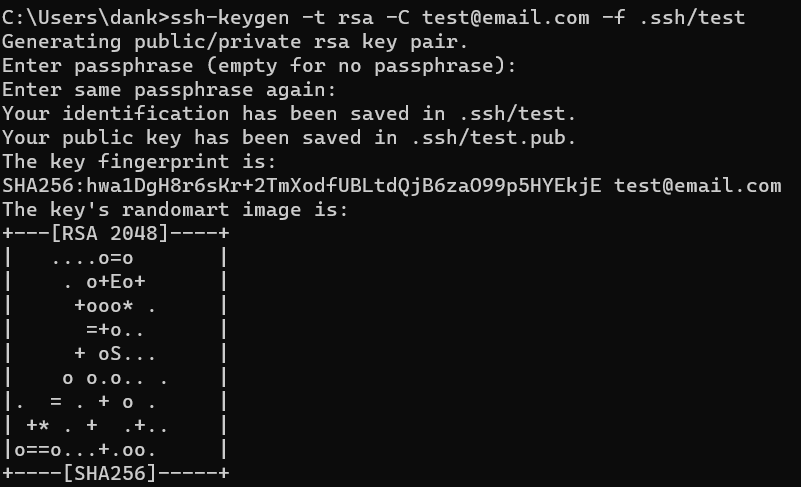
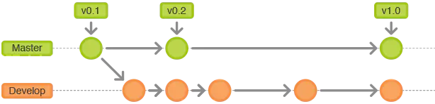

# __Git 使用指南__

## __目录__
* [Git 本地多账户配置](#Git配置)
* [Git 基本指令](#Git指令)
* [Git Flow 工作流](#Git_Flow)

---

<h2 id = Git配置> Git 本地多账户配置 </h2>

<a href = "https://www.jianshu.com/p/c82a24c9d752">本章节参考链接</a>

<h3>步骤一、使用命令生成RSA密钥和公钥</h3>
```git
$ ssh-keygen -t rsa -C 'xxx@email.com' -f file_name
```
> 以上命令运行后，会使用邮箱 `xxx@email.com` 在当前目录下生成文件 `file_name` 和  `file_name.pub`  ，
> 注意：不用让文件名冲突，最好文件名有意义，能看出是哪个 git 地址的 key
> 
> 如下图所示
> 
> 

<h3>步骤二、将 pub 后缀的文件配置到 git 仓库</h3>


<h3>步骤三、在 `~/.ssh` 目录下创建名字为 `config` 的无后缀文件</h3>

每个账号单独配置一个Host，每个Host要取一个别名，每个Host主要配置HostName和IdentityFile两个属性即可。

常用编辑配置说明：

Host：定义Host的名字，可以任取自己喜欢的名字，不过这个会影响Git相关命令。

例如：Host mygithub 这样定义的话，即git@后面紧跟的名字改为mygithub。

命令如下：git clone git@mygithub:PopFisher/AndroidRotateAnim.git。

一般都会和HostName属性其一样的名字。

HostName：这个是真实的域名地址，要登录主机的主机名。（建议与Host一致）

IdentityFile：指定私钥文件的路径，也就是id_rsa文件的绝对路径。

User：配置登录名，例如：GitHub的username。

Port：端口号（如果不是默认22端口，则需要指定端口号）

PreferredAuthentications：配置登录时用什么权限认证，可设为publickey,password publickey,keyboard-interactive等。

示例：
> ```config
> # github user(test@email.com)
> Host github.com
> HostName github.com
> IdentityFile ~/.ssh/github
> PreferredAuthentications publickey
> User test
> ```

<h3>步骤四、测试</h3>

使用ssh -T命令校验，`ssh -T git@host` 以GitHub为例： 

```
ssh -T git@github.com
```

如果成功会显示如下:

`Hi cary! You've successfully authenticated, but GitHub does not provide shell access.`：您已经成功通过身份验证。

多个账户分别验证通过、说明多账户SSHKey配置成功。

如果测试没有成功的话，使用命令 `ssh -vT git@github.com` 查看出错信息

-v参数是输出编译信息，然后根据编译信息自己去解决问题吧。（一般来说，都是config文件中的host那块写错了）


---

<h2 id = Git指令> Git 基本指令 </h2>


[官网文档](https://git-scm.com/ "官网文档")

master	：默认开发分支
origin	：默认远程版本库

Head	：默认开发分支
Head^	：Head的父提交

**git 文件状态变化图**


**创建版本库**

|  命令   | 操作  |    
|  ----  | ----  |    
|$ git clone <url>|克隆远程版本库|
|$ git init|#初始化本地版本库|

**修改和提交**

|  命令   | 操作  |    
|  ----  | ----  |  
|$ git status		|#查看状态|
|$ git diff			|#查看变更内容|
|$ git add			|#跟踪所有改动过的文件|
|$ git add <file>	|#跟踪指定的文件|
|$ git mv <old> <new>	|#文件改名|
|$ git rm <file>	|#删除文件|
|$ git rm --cached <file>	|#停止跟踪文件但不删除|
|$ git commit -m“commit message”	|#提交所有更新过的文件|
|$ git commit - - amend	|#修改最后一次提交|


**查看提交历史**

|  命令   | 操作  |    
|  ----  | ----  |  
|$ git log|#查看提交历史|
|$ git log -p <file>|#查看指定文件的提交历史|
|$ git blame <file>|#以列表方式查看指定文件的提交历史|

**撤消**

|  命令   | 操作  |    
|  ----  | ----  |  
|$ git reset --hard HEAD|#撇消工作目录中所有未提交文件的修改内容|
|$ git checkout HEAD <file>|#撤消指定的未提交文件的修改内容|
|$ git revert <commit>|#撤消指定的提交|

**分支与标签**

|  命令   | 操作  |    
|  ----  | ----  |  
|$ git branch|#显示所有本地分支|
|$ git checkout <branch/tag>| #切换到指定分支或标签|
|$ git branch <new- branch>|#创建新分支|
|$ git branch -d <branch>|#删除本地分支|
|$ git tag|#列出所有本地标签|
|$ git tag <tagname>|#基于最新提交创建标签|
|$ git tag -d <tagname>|#删除标签|

**合井与衍合**

|  命令   | 操作  |    
|  ----  | ----  |  
|$ git merge <branch>|#合并指定分支到当前分支|
|$ git rebase <branch>|#行合指定分支到当前分支|

**远程操作**

|  命令   | 操作  |    
|  ----  | ----  |  
|$ git remote -V|#查看远程版本库信息|
|$ git remote show <remote>|#查看指定远程版本库信息|
|$ git remote add <remote> <url>|#添加远程版本库|
|$ git fetch <remote>|#从远程库获取代码|
|$ git pull <remote> <branch> |#下载代码及快速合并|
|$ git push <remote> <branch> |#上传代码及快速合井|
|$ git push <remote> : <branch/ tag - name>|#删除远程分支或标签|
|$ git push --tags|#上传所有标签|

---

<h2 id = Git_Flow> Git Flow 工作流</h2>

[本章节参考链接](https://www.jianshu.com/p/41910dc6ef29)


<h3> <b>Git Flow 的常用分支</b> </h3>

* **Production 分支**

> 也就是我们经常使用的Master分支，这个分支最近发布到生产环境的代码，最近发布的Release， 这个分支只能从其他分支合并，不能在这个分支直接修改

* **Develop 分支**

> 这个分支是我们是我们的主开发分支，包含所有要发布到下一个Release的代码，这个主要合并与其他分支，比如Feature分支

* **Feature 分支**

> 这个分支主要是用来开发一个新的功能，一旦开发完成，我们合并回Develop分支进入下一个Release

* **Release分支**

> 当你需要一个发布一个新Release的时候，我们基于Develop分支创建一个Release分支，完成Release后，我们合并到Master和Develop分支

* **Hotfix分支**

> 当我们在Production发现新的Bug时候，我们需要创建一个Hotfix, 完成Hotfix后，我们合并回Master和Develop分支，所以Hotfix的改动会进入下一个Release

<h3> <b>Git Flow 如何使用</b> </h3>

* Master/Devlop 分支

> 所有在Master分支上的Commit应该打上Tag，一般情况下Master不存在Commit，Devlop分支基于Master分支创建

> 

* Feature 分支

> Feature分支做完后，必须合并回Develop分支, 合并完分支后一般会删点这个Feature分支，毕竟保留下来意义也不大。

> 

* Release 分支

> Release分支基于Develop分支创建，打完Release分支之后，我们可以在这个Release分支上测试，修改Bug等。同时，其它开发人员可以基于Develop分支新建Feature (记住：一旦打了Release分支之后不要从Develop分支上合并新的改动到Release分支)发布Release分支时，合并Release到Master和Develop， 同时在Master分支上打个Tag记住Release版本号，然后可以删除Release分支了。

> 

* Hotfix 分支

> hotfix分支基于Master分支创建，开发完后需要合并回Master和Develop分支，同时在Master上打一个tag。

> 

<h3> Git Flow 命令示例</h3>

**创建 Devlop**
```git
git branch develop  
git push -u origin develop
```

**开始 Feature**
```
# 通过develop新建feaeure分支
git checkout -b feature develop
# 或者, 推送至远程服务器:
git push -u origin feature    

# 修改md文件   
git status
git add .
git commit
```

**完成 Feature**
```
git pull origin develop
git checkout develop 

#--no-ff：不使用fast-forward方式合并，保留分支的commit历史
#--squash：使用squash方式合并，把多次分支commit历史压缩为一次

git merge --no-ff feature
git push origin develop

git branch -d some-feature

# 如果需要删除远程feature分支:
git push origin --delete feature   
开始 Release
git checkout -b release-0.1.0 develop
```

**完成 Release**

```
git checkout master
git merge --no-ff release-0.1.0
git push

git checkout develop
git merge --no-ff release-0.1.0
git push


git branch -d release-0.1.0
git push origin --delete release-0.1.0   

# 合并master/devlop分支之后，打上tag 
git tag -a v0.1.0 master
git push --tags
```

**开始 Hotfix**
```
git checkout -b hotfix-0.1.1 master  
完成 Hotfix
git checkout master
git merge --no-ff hotfix-0.1.1
git push


git checkout develop
git merge --no-ff hotfix-0.1.1
git push

git branch -d hotfix-0.1.1
git push origin --delete  hotfix-0.1.1 


git tag -a v0.1.1 master
git push --tags
```